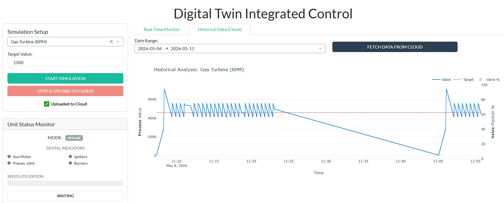

# 🏭 Digital Twin & Cloud SCADA System


## 📌 Descripción del Proyecto
Este proyecto es una implementación completa **End-to-End** de un Gemelo Digital (Digital Twin) para equipamiento industrial. Simula el comportamiento físico y el control automático (PID) de sistemas reales, enviando telemetría a la nube y permitiendo su monitoreo a través de una interfaz moderna construida en Python.

**El objetivo:** Demostrar cómo integrar modelos de ingeniería de procesos con arquitecturas de software modernas orientadas a datos (Cloud-Native).

---

## 📸 Demostración


> *Ejemplo: *

---

## 🚀 Características Principales

* **Simulación Física y Control PID:** Modelado matemático de equipos industriales (Bombas centrífugas, Tanques de nivel, Turbinas de gas) con lazos de control cerrados en tiempo real.
* **Interfaz HMI Reactiva (Dash/Plotly):** Panel de control web interactivo que permite instanciar gemelos digitales, modificar *setpoints* (targets) y visualizar la respuesta del sistema segundo a segundo sin recargar la página.
* **Cloud Data Warehousing:** Integración directa con **Google BigQuery**. Los datos de las sesiones de simulación se suben a la nube de forma segura y eficiente para su almacenamiento persistente.
* **Análisis Histórico:** Capacidad de consultar BigQuery desde el mismo Dashboard filtrando por fechas, mostrando gráficos avanzados de doble eje (Variable de proceso vs. Posición de la válvula) para analizar el rendimiento histórico y la estabilidad del sistema.
* **Panel de Diagnóstico Industrial:** Indicadores digitales (LEDs), barras de utilización y alertas dinámicas de sobrevelocidad/emergencia integradas en la interfaz.

---

## 🏗️ Arquitectura del Sistema

El sistema sigue un patrón de diseño donde la Interfaz de Usuario actúa como orquestador general:

1. **Frontend / HMI:** Dash Bootstrap Components.
2. **Motor de Simulación (Local):** Clases orientadas a objetos (`ControlledPump`, etc.) que calculan la física y el error PID paso a paso en memoria RAM.
3. **ETL y Nube:** Módulo `BigQueryUploader` que consolida los datos locales y realiza inserciones en GCP al finalizar cada sesión de simulación.
4. **Data Retrieval:** Consultas SQL parametrizadas desde Pandas-GBQ para renderizar el historial.

---

## ⚙️ Instalación y Uso

### 1. Clonar el repositorio
```bash
git clone [https://github.com/RodrigoM10/Digital-Twin.git](https://github.com/RodrigoM10/Digital-Twin.git)
cd Digital-Twin
